# 🎵 Melodycomp


<!--  -->


> Your AI creative partner for music composition. Melodycomp understands genre, music theory, and user ideas to generate high-quality chord progressions and melodies.

---

## ✨ Demo

A quick look at Melodycomp in action. From a simple prompt to a downloadable MIDI file with chords and a unique melody.

*DEMO COMING SOON*

---

## ✨ Features

* **Contextual Chord Generation**: Creates chord progressions from natural language prompts that include genre, key, and mood.
* **AI-Powered Melody Composition**: Generates a unique, stylistically appropriate melody over the generated chords.
* **Music Theory Insights**: Provides relevant tips, tricks, and scale suggestions to inspire creativity.
* **RAG-Powered Knowledge**: Uses a vector database (ChromaDB) to retrieve genre-specific information, making its suggestions more authentic.
* **Hardware-Accelerated Local AI**: Leverages Apple's **MLX** framework for fast, efficient melody generation on Mac M-series chips.

---

## 🛠️ Tech Stack & Architecture

This project uses a multi-model, hybrid architecture to balance performance and capability. It utilizes both local models as well as the Google API for stronger LLM capabilities.

* **Frontend**: Streamlit
* **Agent Framework**: `LangChain`
* **Vector Database**: `ChromaDB`
* **Core LLMs**:
    * *Google Gemini*: For high-level reasoning, chord generation, and robust parsing.
    * *Qwen3-8B-4bit*: A powerful local model for creative melody generation.
* **Hardware Acceleration**: **MLX** (for Apple Silicon)
* **Music Toolkit**: `pretty-midi`
* **Knowledge Base**:
    * Custom-written markdown files on musical genres.
    * Chord voicings derived from the **Chordonomicon** dataset.

#### Architecture Flow

```mermaid
graph TD
    A[User Prompt in Streamlit] --> B{"Chord Agent<br>(LangChain + Gemini)"};
    B --> C[Chord Progression];
    B --> J[🎸 Music Theory Tips]
    C --> D{"Melody Generator<br>(MLX + Qwen3)"};
    D --> E[ABC Notation];
    E --> F{"ABC Parser<br>(Gemini)"};
    F --> G[Note JSON];
    C --> H[Download Chords .mid];
    G --> I[Download Melody .mid];
```



---

## 🚀 Setup and Installation

Follow these steps to get Melodycomp running locally.

**1. Clone the repository:**

```bash
git clone [https://github.com/DanVicenteIhanus/melodycomp.git](https://github.com/DanVicenteIhanus/melodycomp.git)
cd melodycomp
```

**2. Create a virtual environment and install dependencies:**

`uv` is a blazing-fast Python package installer and resolver, written in Rust. It's a drop-in replacement for `pip` and `pip-tools`. The recommended and tested way to install melodycomp is using uv.

```bash
# On macOS and Linux
curl -LsSf [https://astral.sh/uv/install.sh](https://astral.sh/uv/install.sh) | sh

# On Windows
powershell -c "irm [https://astral.sh/uv/install.ps1](https://astral.sh/uv/install.ps1) | iex"

# Create and activate the virtual environment
uv venv

# Install all dependencies
uv pip install ".[dev]"
```
If you prefer, you can use pip to install everything using `requirements.txt`

```bash
# create the venv
python -m venv .venv
# activate venv
source .venv/bin/activate
# install all dependencies
pip install requirements.txt
```
**4. Configure API Keys:**

* Rename the `configs/config_example.yaml` file to `configs/config.yaml`.
* Add your Gemini API key to the `config.yaml` file.

**5. Download the Local Model:**

* Download a GGUF model file compatible with MLX from the **ChatMusician** repository:
    * **Link**: [MaziyarPanahi/ChatMusician-GGUF on Hugging Face](https://huggingface.co/MaziyarPanahi/ChatMusician-GGUF)
* Place the downloaded model file (e.g., `ChatMusician-4bit-MLX.gguf`) in a `models/` directory at the root of the project.

---

## ▶️ Usage

To run the Streamlit application, use the following command from the root directory:

```bash
streamlit run app.py
```

Then open your browser to `http://localhost:8501`.

---

## 🛣️ Future Work

* [ ] Implement an interactive feedback loop to refine generated music.
* [ ] Fine-tune the local model on a curated dataset of `(chords, melody)` pairs built using Chordonomicon.
* [ ] Add support for more instruments and musical styles.
---

## 📜 License

This project is licensed under the MIT License. See the [LICENSE](LICENSE) file for details.
